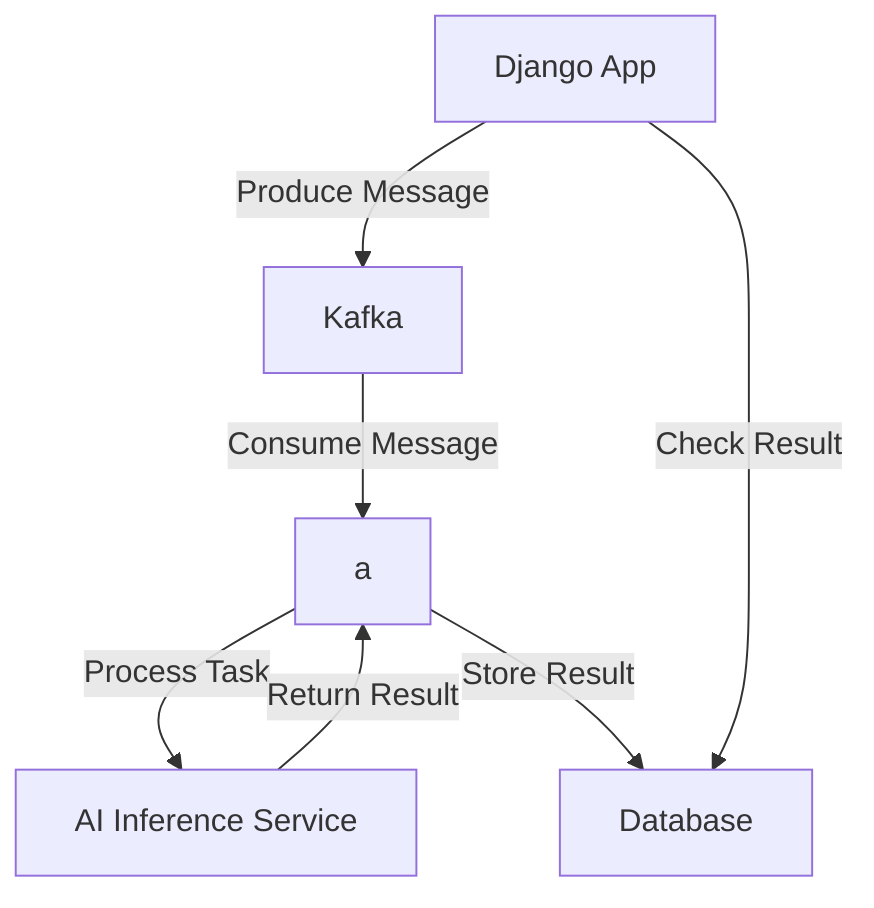

```mermaid
graph TD
    A[Django App] -->|Produce Message| B[Kafka]
    B -->|Consume Message| C[a]
    C -->|Process Task| D[AI Inference Service]
    D -->|Return Result| C
    C -->|Store Result| E[Database]
    A -->|Check Result| E
```

TODO: Celery??
