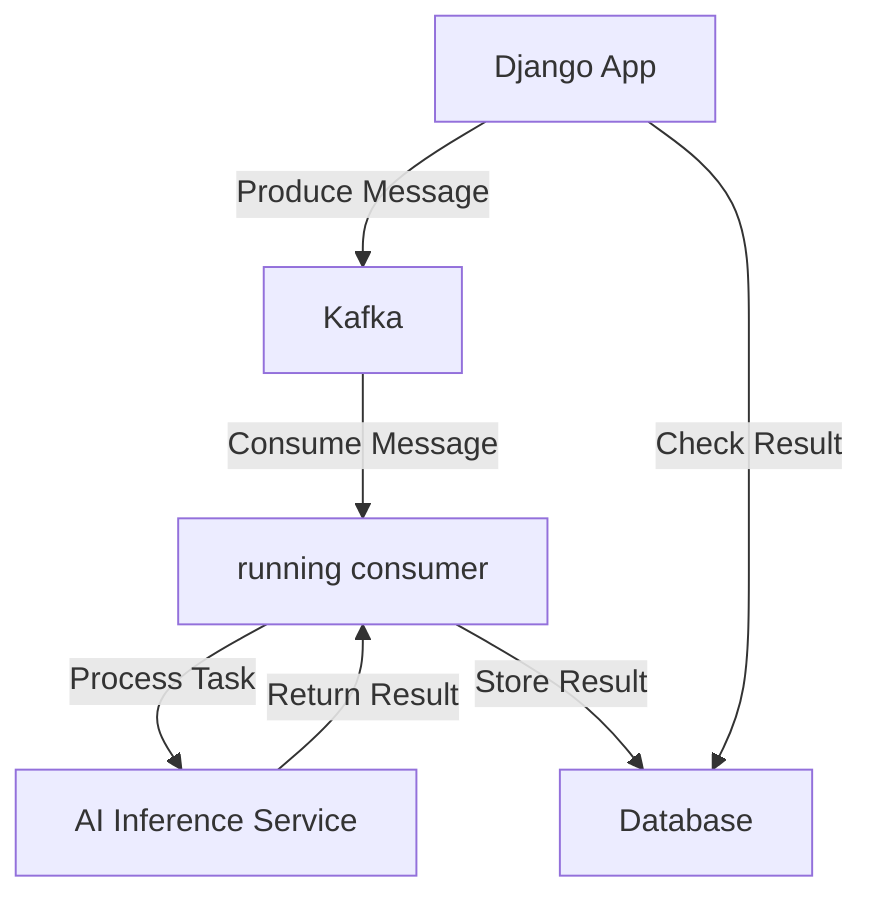
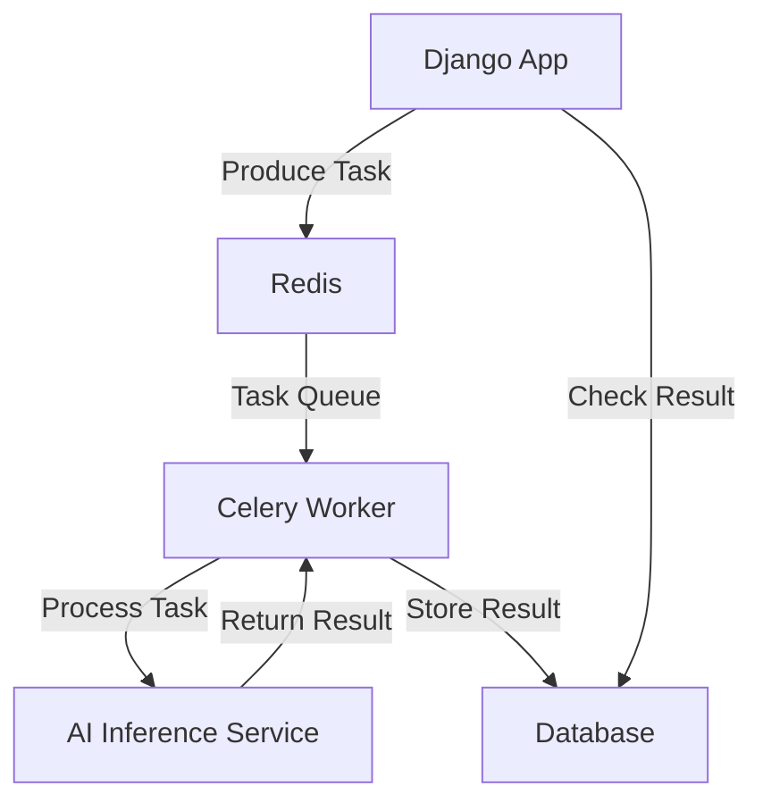

```mermaid
graph TD
    A[Django App] -->|Produce Message| B[Kafka]
    B -->|Consume Message| C[running consumer]
    C -->|Process Task| D[AI Inference Service]
    D -->|Return Result| C
    C -->|Store Result| E[Database]
    A -->|Check Result| E
```

ABOVE NOT USED ANYMORE

## from plan 3.8

similar to above, but with redis and celery worker. not consuming from kafka anymore.

```mermaid
graph TD
    A[Django App] -->|Produce Task| B[Redis]
    B -->|Task Queue| C[Celery Worker]
    C -->|Process Task| D[AI Inference Service]
    D -->|Return Result| C
    C -->|Store Result| E[Database]
    A -->|Check Result| E
```
